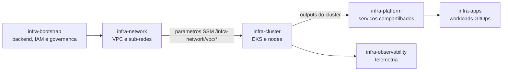

# infra-cluster

Produto de infraestrutura responsável pela fundação do Amazon EKS. Consome a
rede publicada pelo [`infra-network`](https://github.com/AloisioBarbosa/infra-network)
via AWS Systems Manager Parameter Store e publica os dados do cluster para os
produtos downstream.

## Estado operacional

Implantação confirmada em 7 de agosto de 2026:

- `infra-network`: apply concluído com sucesso na run
  [`31185537460`](https://github.com/AloisioBarbosa/infra-network/actions/runs/31185537460);
- `infra-cluster`: apply concluído com sucesso na run
  [`31186635717`](https://github.com/AloisioBarbosa/infra-cluster/actions/runs/31186635717);
- cluster EKS `infra-cluster`: `ACTIVE` em `us-east-1`;
- Kubernetes: `1.33`;
- managed node group: `infra-cluster`.

O produto está implantado, mas ainda não deve ser classificado como
production-ready até concluir as pendências de segurança e operação do roadmap.

## Escopo do produto

Inclui:

- cluster EKS, KMS e logs do control plane;
- managed node group e IAM das instâncias;
- add-ons gerenciados `vpc-cni`, `coredns`, `kube-proxy` e
  `eks-pod-identity-agent`;
- autenticação, access entry dos nodes e provider OIDC do cluster;
- outputs que formam o contrato com `infra-platform`.

Não inclui novos serviços compartilhados, workloads de aplicação, rede ou
observabilidade completa. O `metrics-server` está em handoff para o
`infra-platform`: o bloco `removed` retira sua propriedade deste state sem
desinstalar o release. `kube-state-metrics` permanece temporariamente neste
produto e será migrado em uma mudança futura.

## Dependências e contratos



Inputs da rede:

- `/infra-network/vpc/subnet_private_1a`, `1b` e `1c`;

Outputs publicados:

- `cluster_name` e `cluster_endpoint`;
- `cluster_certificate_authority_data` (sensitive);
- `cluster_oidc_issuer_url`;
- `cluster_security_group_id`;
- `node_role_arn`.

## Uso local

Pré-requisitos: Terraform 1.7 ou superior, credenciais AWS e o
`infra-network` já aplicado.

```bash
cp terraform.tfvars.example terraform.tfvars
terraform init \
  -backend-config="bucket=<bucket>" \
  -backend-config="key=cluster/dev/terraform.tfstate" \
  -backend-config="region=us-east-1" \
  -backend-config="use_lockfile=true"
terraform fmt -check -recursive
terraform validate
terraform plan
```

O arquivo `terraform.tfvars` não deve ser commitado. Adapte capacidade e versão
do Kubernetes antes do plan. Prefira uma versão EKS em suporte padrão.

## GitHub Actions

Pull Requests executam format, validate, TFLint, Trivy e um plan autenticado
com credenciais AWS armazenadas como secrets. O merge em `main` gera um novo
plano e aguarda aprovação no environment `production` antes do apply. A
configuração completa e o trade-off temporário estão em
[`CI-SETUP.md`](CI-SETUP.md).

O incidente de dependência ausente foi resolvido. O
[`registro de retomada`](docs/CONTINUATION.md) preserva a causa, a recuperação
executada e as pendências restantes.

O pipeline disponibiliza destroy somente por acionamento manual, confirmação
textual, plano armazenado e aprovação no environment `production`. Siga o
[`runbook de desligamento`](docs/DESTROY-RUNBOOK.md). A ordem obrigatória é
`infra-platform` antes de `infra-cluster`, e `infra-network` por último.

## Operação e rollback

- Não execute dois plans/applies para o mesmo state em paralelo.
- Revise substituições (`-/+`) e deleções antes de aprovar production.
- Para rollback de código, reverta o commit e gere um novo plan; o state não
  deve ser alterado manualmente sem backup e plano de migração.
- Upgrades do EKS devem avançar uma minor version por vez, incluindo add-ons e
  nodes na validação.
- Falhas de lookup SSM indicam que a rede não foi aplicada, a região está
  incorreta ou a role do CI não possui `ssm:GetParameter`.
- A remoção ou indisponibilidade dos parâmetros SSM do `infra-network` bloqueia
  corretamente o plan deste produto; restaure a rede antes de prosseguir.

## Roadmap

1. Migrar a autenticação do pipeline para uma role OIDC exclusiva, gerenciada
   pelo `infra-bootstrap`, e eliminar as access keys estáticas.
2. Restringir regras de security group atualmente amplas e validar conectividade.
3. Concluir o import do `metrics-server` no `infra-platform` e, em uma mudança
   separada, migrar `kube-state-metrics` pelo mesmo padrão não destrutivo.
4. Publicar o contrato do cluster em SSM para reduzir acoplamento a remote state.
5. Adicionar testes Terraform e política de upgrade periódico do EKS.

## Ownership

Owner: time de Cloud Platform. Alterações exigem revisão de segurança para IAM,
KMS, endpoints, security groups ou trust policies e evidência do Terraform plan.

Licença: MIT.
